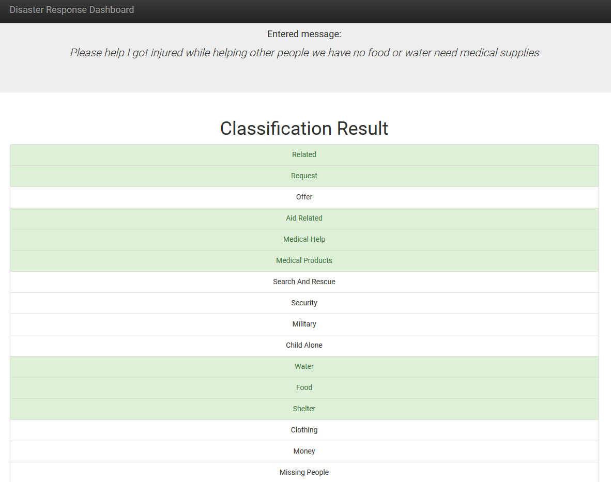
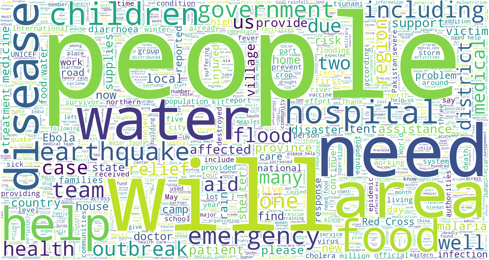

# Disaster Response Web App

## Table of Contents
1. [Description](#description)
2. [Getting Started](#getting_started)
3. [Authors](#authors)
4. [License](#license)

## Description

The project aim is to build a NLP model to categorize messages and create a web app through which new messages could be classified. The dataset contains pre-labelled tweets and messages from real disaster events.

This project is divided in the following key sections:

1. Processing data, building an ETL pipeline to extract data from two csv files, cleaning the data and saving them it to a database
2. Build a machine learning pipeline to train model which can classify text message into set categories
3. Create web app which can be used for prediction of new messages

## Getting Started

### Dependencies
* Python 3.5+
* Data Preprocessing: NumPy, Pandas
* Machine Learning Libraries: Sciki-Learn, XGBoost
* Natural Language Process Libraries: NLTK
* Database Library: SQLalchemy
* Model Loading and Saving Library: Pickle
* Web App and Data Visualization: Flask, Plotly

### Executing Program:
You can run the following commands in the project's directory to set up the database, train model and save the model.

    - To run ETL pipeline to clean data and store the processed data in the database
        `python etl.py data/disaster_messages.csv data/disaster_categories.csv data/database.db`

    - To run the ML pipeline that loads data from database, trains the classifier and saves the classifier as a pickle file
        `python train_classifier.py data/database.db models/classifier.pkl`

		- Run the following command in the app's directory to run the web app. One does not need to run the previous two steps as their output is already saved.
        `python run.py`

    - Type localhost:3001 in your browser

### Additional Material

In the **data** and **models** folder you can find jupyter notebooks that will help you understand how the code was developed
1. **ETL Pipeline Dev**: on development of ETL pipeline
2. **ML Pipeline Dev**: on development of Machine Learning Pipeline

### Important Files
**app/templates/***: templates/html files for web app

**data/etl.py**: ETL pipeline used for data cleaning, feature extraction, and storing data in a SQLite database

**models/train_classifier.py**: A machine learning pipeline that loads data, trains a model, and saves the trained model as a .pkl file for later use

**run.py**: This file can be used to launch the Flask web app used to classify disaster messages

## Authors

* [Dario Culig-Tokic](https://darioct.github.io/)

## License

